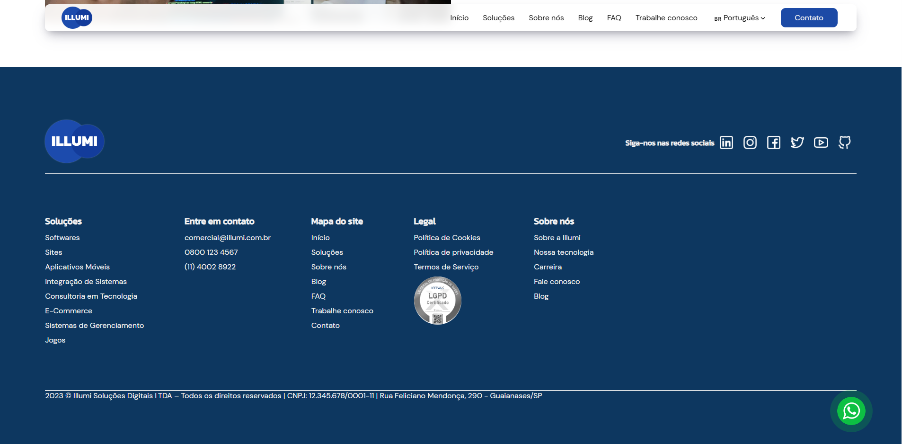

# Illumi | Desenvolvimento e Softwares

## 📖 Sobre o Projeto

Illumi Soluções Digitais LTDA é uma empresa que transforma ideias em soluções digitais, oferecendo desenvolvimento de softwares personalizados para impulsionar empresas com tecnologia inovadora. Nosso foco é ajudar negócios a saírem do papel para o mundo digital, com sistemas, sites, aplicativos e integrações sob medida.

## 💡 Funcionalidades Principais

- Desenvolvimento de softwares personalizados  
- Criação de websites responsivos e modernos  
- Aplicativos móveis para múltiplas plataformas  
- Integração de sistemas para otimizar processos  
- Consultoria em tecnologia e inovação  
- E-commerce e sistemas de gerenciamento  
- Suporte e manutenção contínua  

## 🖼️ Screenshots
<p align="center">
  
</p>

<p align="center">
  
</p>

<p align="center">
  
</p>

<p align="center">
  
</p>

## 🛠️ Tecnologias Utilizadas

- PHP (com includes para componentes)  
- HTML5, CSS3 (estilização própria)  
- JavaScript e jQuery  
- Biblioteca Slick para carrossel  
- FontAwesome para ícones  

## 💻 Como Rodar Localmente

1. Clone este repositório:  
   ```bash
   git clone https://github.com/Illumi-Etec/illumi.git
